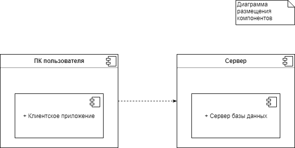
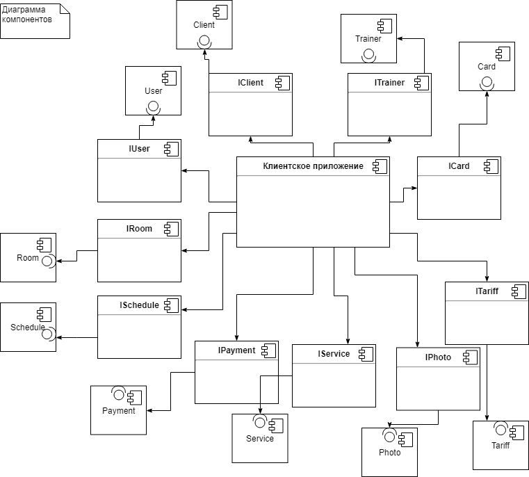

**Лабораторная работа № 6**

**Задание:** Определить интерфейсы классов, разработать диаграммы компонентов и размещения UML по проекту АИС.

 

Рисунок 1 Диаграмма размещения

 
На диаграмме размещения изображены узлы выполнения программных компонентов, а также объектов. Показано, что клиентское приложение, установленное на компьютере пользователя, взаимодействует с сервером, который содержит в себе базу данных.

Рисунок 2 Диаграмма компонентов

На данной диаграмме изображены все компоненты: клиентское приложение, работники, клиенты, услуги, расписание, помещения, карты, тарифы, платежи, пользователи. Эти компоненты взаимодействуют друг с другом с помощью интерфейсов.

Рисунок 3 Диаграмма интерфейсов

*Список интерфейсов:*

+ [IUser](#IUser);
+ [IClient](#IClient);
+ [ITrainer](#ITrainer);
+ [IPhoto](#IPhoto);
+ [IService](#IService);
+ [ITariff](#ITariff);
+ [IRoom](#IRoom);
+ [ICard](#ICard);
+ [ISchedule](#ISchedule);
+ [IPayment](#IPayment);

<a name="IUser">[**IUser**](./IUser.md)</a>
-----

+ +Del(ID : int) - функция удаления пользователя;

+ +Validation(Login:string, Password:string) - функция проверки логина и пароля, вводимых пользователем.

<a name="IClient">[**IClient**](./IClient.md)</a>
***

+ +Add(FIO:string, Sex:bool, Height:int, Weight:int, Health:int, Phone:int, DOB:DateTime, Comment:string) – функция добавления пользователя в БД;

+ +Save(FIO:string, Sex:bool, Height:int, Weight:int, Health:int, Phone:int, DOB:DateTime, Comment:string) – функция сохранения изменений;

+ +GetAll() - выводит список всех клиентов;

+ +FindClientByID(ID : int)  - поиск клиента по ID;

<a name="ITrainer">[**ITrainer**](./ITrainer.md)</a>
***

+ +GetAll() - выводит список всех тренеров;

+ +FindTrainerByID(ID : int) - поиск тренера по ID;

+ Add(FIO:string, Sex:bool,  Qualification:string, Phone:int, DOB:DateTime, Comment:string) - функция добавления тренера в БД.

<a name="IPhoto">[**IPhoto**](./IPhoto.md)</a>
***

+ +Add() – функция добавления фото в БД;

+ +Del(ID : int) – функция удаления фото (Присвоение статуса «удаленный»).

<a name="IService">[**IService**](./IService.md)</a>
***

+ +Add(Name:string, Cost:int, Comment:string)– функциядобавленияуслугивБД;

+ +Del(ID : int) – функция удаления услуги (Присвоение статуса «удаленная»);

+ +Save(Name:string, Cost:int, Comment:string) – функциясохраненияизменений;

+ +GetAll() - вывести список всех услуг;

+ +GetTrainers(ID\_Servise : int) - вывести всех тренеров услуги;

+ +FindServiceByID(ID : int) - поискуслугипо ID;

+ +GetBalanceService(IDCard : int) - показать баланс карты, то есть количество услуги на карте;

+ +GetBalanceFrost(IDCard : int) - показать количество дней заморозки.

<a name="ITariff">[**ITariff**](./ITariff.md)</a>
***

+ +Add(Name:string, Duration:int, TotalCost:float, StartDate:DateTime, DateRemoved:DateTime) - Добавитьновыйтариф;

+ +GetServices() - показать услуги по тарифу;

+ +Del(ID : int) – функция удаления тарифа (Присвоение статуса «удаленный»);

+ +Save(Name:string, Duration:int, TotalCost:float, StartDate:DateTime, DateRemoved:DateTime) – функциясохраненияизменений;

+ +GetAll() - вывести список всех тарифов;

+ +FindTarrifsByID(ID : int) - найти тариф по ID;

<a name="IRoom">[**IRoom**](./IRoom.md)</a>
***

+ +Add(Name:string, Equipment:string,

Capasity:int,Comment:string) - Добавитьпомещение;

+ +Del(ID : int) – функция удаления помещение (Присвоение статуса «удаленное»);

+ +Save(Name:string, Equipment:string, Capasity:int,Comment:string) – функция сохранения изменений;

+ +GetAll() - вывести список всех помещений;

+ +FindRoomByID(ID : int) - поискпо ID;

+ +GetScheduleRoomByTime(ID:int) - показать расписание помещения

<a name="ICard">[**ICard**](./ICard.md)</a>
***

+ +Add(IDTariff: int) - Добавить карту;

+ +Del(ID : int) – функция удаления карты (Присвоение статуса «удаленная»);

+ +Save(IDTariff: int) – функция сохранения изменений;

+ +GetAll() - вывести список всех карт;

+ +FindCardByID(ID : int) - поискпо ID;

+ +ShowBalance(Card : FindCardByID(ID : int)) - показатьостатокуслугпокарте;

+ +AddVisit(ID\_Card : int, ID\_Service : int) - добавитьпосещение;

+ +DelVisit(ID\_Card : int, ID\_Service : int) - удалитьпосещение;

+ +FrostCard(IDCard : int, StartDate : DateTime, EndDate : DateTime) - заморозкакарты

<a name="ISchedule">[**ISchedule**](./ISchedule.md)</a>
***

+ +Add(Trainer : Trainer, Card : Card, Service : Service, Room : Room, Date : DateTime) - Добавитьзапись;

+ +Del(ID : int) – функция удаления запись (Присвоение статуса «удаленная»);

+ +Save(Trainer : Trainer, Card : Card, Service : Service, Room : Room, Date : DateTime) – функциясохраненияизменений;

+ +AddFrost( StartDate : DateTime, EndDate : DateTime, IDCard:int) - заморозитькарту;

+ +GetAll() - вывести список всех записей;

<a name="IPayment">[**IPayment**](./IPayment.md)</a>
***

+ +Add(IDCard:int, Date:DateTime, Amount:int) - Добавить платеж;

+ +Del(ID : int) – функция удаления платежа из БД;

+ +GetAll() - вывести список всех платежей.

